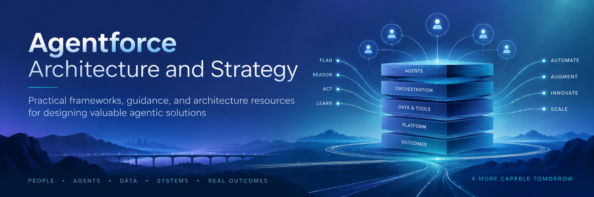

# Agentforce Architecture and Strategy

  

## Overview

Agentforce Architecture and Strategy is a collection of practical frameworks, guidance, discovery tools, and architecture resources for designing responsible, scalable, and valuable agentic solutions on the Salesforce platform.

It is intended for architects, strategists, business analysts, admins, developers, and delivery teams working to move from an Agentforce idea to an architecture that can deliver measurable business value.

## The Problem It Solves

Building an Agentforce solution involves much more than configuring an agent, creating topics, or writing instructions.

Teams must determine where agentic reasoning adds value, where deterministic automation is more appropriate, what enterprise context the agent requires, how systems and data should participate in the architecture, when humans should remain involved, and how success will be measured.

These resources help teams approach those decisions deliberately.

The repository captures architecture principles, discovery approaches, lessons learned, process frameworks, questions to ask, and practical patterns intended to serve as a catalyst for better Agentforce design and implementation.

The goal is not to prescribe one architecture.

What this repository is really creating is a body of material that helps another architect **think better** about Agentforce—not blindly reproduce someone else’s implementation.

The goal is to help teams ask better questions, make better decisions, and build agentic solutions that are practical, scalable, trustworthy, and valuable.

## See it in Action

Forthcoming. Date TBD.

## Quick Start Guide

The resources in this repository are designed to be used as guidance rather than as a rigid implementation methodology.

Start with the material most relevant to the problem you are trying to solve. Use the frameworks, discovery questions, process maps, architecture principles, and lessons learned to challenge assumptions and help shape your own approach.

These assets are intended to:

- Provide a catalyst for architecture and strategy discussions.
- Help teams ask stronger questions during discovery.
- Identify important architectural decisions earlier in the lifecycle.
- Share practical patterns, best practices, and lessons learned from real-world Agentforce work.
- Connect technical architecture decisions to business value, ROI, Time to Value, and Total Cost of Ownership.
- Encourage thoughtful decisions about autonomy, deterministic controls, enterprise context, human participation, trust, testing, and observability.

Adapt the material to your organization, use case, industry, risk profile, and existing enterprise architecture.

## About the Creator

Built by [@sforceROCKER](https://github.com/sforceROCKER) as part of the Salesforce Trailblazer Labs Builder in Residence Cohort.

Joseph Kubon is a Salesforce Technical Architect, author, and AI strategist with deep platform architecture experience. He is a 5x Salesforce MVP, 2026 Architect Ambassador, and winner of the TDX25 Agentforce Hackathon Grand Prize, with a focus on practical, scalable agentic solutions that deliver measurable business value.

- [LinkedIn Profile](https://www.linkedin.com/in/sforcerocker/)
- [Salesforce Trailblazer Profile](https://www.salesforce.com/trailblazer/sforceROCKER)
